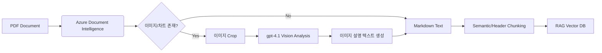

# 🇰🇷 Azure Hybrid RAG Document Parser

이 프로젝트는 **Azure AI Document Intelligence (Layout Model)**와 **Azure OpenAI (GPT-4.1)**를 결합하여, 한국어 문서에 최적화된 RAG(Retrieval-Augmented Generation) 데이터 파이프라인을 제공합니다.

기존의 단순 OCR 방식이 놓치기 쉬운 **복잡한 표 구조**를 유지하고, **이미지/차트의 의미를 해석**하여 텍스트로 변환함으로써 검색 정확도(Retrieval Accuracy)를 극대화합니다.

## ✨ 주요 기능 (Key Features)

1.  **Hybrid Parsing Strategy**:
    * **텍스트/표/구조**: Azure Document Intelligence의 Layout 모델을 사용하여 저렴하고 빠르게 Markdown 구조를 추출합니다.
    * **이미지/차트**: 문서 내 시각 자료(Figure)만 감지하여 **gpt-4.1(Vision)**가 설명을 생성합니다. (비용 효율적)
2.  **Korean Context Optimization**:
    * 한국어 문서 특성(조사, 어미 등)을 고려한 Recursive Chunking 전략을 적용했습니다.
    * Markdown Header(#, ##)를 기준으로 1차 분할하여 의미 단위가 섞이는 것을 방지합니다.
3.  **Coordinate Mapping**:
    * PDF 원본 이미지와 Azure DI 결과의 좌표를 매핑하여 정확한 이미지를 Crop 합니다.

## 🏗️ 아키텍처 (Architecture)



## 🚀 시작하기 (Getting Started)

### 1. 필수 조건 (Prerequisites)
* Python 3.9+
* Azure 구독 (Azure AI Document Intelligence, Azure OpenAI Service)
* `poppler-utils` 설치 (PDF 이미지 변환용)
    * Mac: `brew install poppler`
    * Linux: `sudo apt-get install poppler-utils`
    * Windows: [Poppler for Windows](http://blog.alivate.com.au/poppler-windows/) 설치 후 PATH 추가

### 2. 설치 (Installation)

```bash
git clone [https://github.com/your-username/azure-hybrid-rag-parser.git](https://github.com/your-username/azure-hybrid-rag-parser.git)
cd azure-hybrid-rag-parser
pip install -r requirements.txt
```

### 3. 환경 변수 설정 (.env)

`.env.example` 파일을 복사하여 `.env`를 생성하고 키 값을 입력하세요.

```ini
AZURE_DI_ENDPOINT="[https://your-resource.cognitiveservices.azure.com/](https://your-resource.cognitiveservices.azure.com/)"
AZURE_DI_KEY="your-key"
AZURE_OPENAI_ENDPOINT="[https://your-resource.openai.azure.com/](https://your-resource.openai.azure.com/)"
AZURE_OPENAI_KEY="your-key"
AZURE_OPENAI_DEPLOYMENT="gpt-4.1"
```

### 4. 실행 (Usage)

PDF 파일을 `sample_docs/` 폴더에 넣고 실행합니다.

```bash
python main.py
```

## 📂 출력 결과 예시

파싱된 결과는 `output/processed_doc.md`에 저장되며, 아래와 같이 **텍스트와 이미지 설명이 결합된 형태**가 됩니다.

```markdown
# 2024년 4분기 매출 보고서

## 1. 개요
이번 분기 매출은 전년 대비 상승했습니다...

> **[이미지/차트 설명 1]**
> 제공된 막대 그래프는 2023년과 2024년의 월별 매출을 비교하고 있습니다.
> 2024년 10월 매출은 5억 원으로, 작년 동기(3억 원) 대비 약 66% 성장했습니다.
> 핵심 요인은 신규 서비스 출시로 분석됩니다.

## 2. 세부 지표
...
```

## 🛠️ Tech Stack
* **Parsing**: Azure AI Document Intelligence (Layout)
* **Vision Analysis**: Azure OpenAI gpt-4.1
* **Chunking**: LangChain (MarkdownHeaderTextSplitter)
* **Image Processing**: PDF2Image, Pillow

## License
MIT License


azure-hybrid-rag-parser/
├── .env.example                # 환경변수 설정 예시
├── .gitignore                  # git 제외 설정
├── README.md                   # 설명서
├── requirements.txt            # 의존성 라이브러리
├── main.py                     # 실행 예시 파일
└── src/
    ├── __init__.py
    ├── parser.py               # Azure DI + gpt-4.1 파싱 로직
    └── chunker.py              # 한국어 최적화 청킹 로직