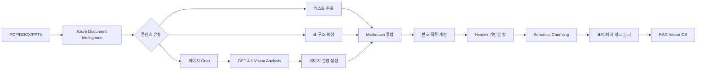

# 🇰🇷 Azure Hybrid RAG Document Parser

이 프로젝트는 **Azure AI Document Intelligence (Layout Model)**와 **Azure OpenAI (GPT-4.1)**를 결합하여, 한국어 문서에 최적화된 RAG(Retrieval-Augmented Generation) 데이터 파이프라인을 제공합니다.

기존의 단순 OCR 방식이 놓치기 쉬운 **복잡한 표 구조**를 유지하고, **이미지/차트의 의미를 해석**하여 텍스트로 변환함으로써 검색 정확도(Retrieval Accuracy)를 극대화합니다.

## ✨ 주요 기능 (Key Features)

### 1. Hybrid Parsing Strategy
| 기능 | 설명 |
|------|------|
| **텍스트/표/구조** | Azure Document Intelligence Layout 모델로 Markdown 구조 추출 |
| **이미지/차트 분석** | GPT-4.1(Vision)이 이미지 유형별 상세 설명 생성 |
| **표(Table) 상세 파싱** | 행/열/셀 구조를 보존하여 Markdown 표로 변환 |
| **번호 목록 보존** | "06 제목" → "### 06. 제목" 형식으로 자동 변환 |

### 2. Korean Context Optimization
- 한국어 문서 특성(조사, 어미 등)을 고려한 **Semantic Chunking** 전략
- Markdown Header(#, ##, ###)를 기준으로 1차 분할하여 의미 단위 보존
- 표/이미지 설명 블록을 별도 청크로 분리하여 검색 최적화

### 3. 이미지 유형별 분석 (Vision Analysis)
| 이미지 유형 | 분석 내용 |
|------------|----------|
| **UI 스크린샷** | 메뉴 경로, 버튼명, 설정값, 조작 순서 |
| **표(Table)** | 행/열 구조, 데이터 값, 셀 병합 관계 |
| **다이어그램/순서도** | 화살표 방향, 흐름 순서, 노드 내용 |
| **차트/그래프** | 수치, 추세, 범례, 축 레이블 |

### 4. 고급 청킹 기능
- **표 구조 보존**: 표가 청크 중간에 잘리지 않도록 별도 청크로 유지
- **이미지 설명 블록 보존**: 이미지 설명을 독립 청크로도 생성
- **폴백 처리**: Semantic Chunking 실패 시 RecursiveCharacterTextSplitter로 대체
- **메타데이터 강화**: `type`, `chunk_id`, `contains_image_desc`, `contains_numbered_section`

## 🏗️ 아키텍처 (Architecture)


```mermaid
graph LR
    A[PDF/DOCX/PPTX] --> B(Azure Document Intelligence)
    B --> C{콘텐츠 유형}
    C --> D[텍스트 추출]
    C --> E[표 구조 파싱]
    C --> F[이미지 Crop]
    F --> G[GPT-4.1 Vision Analysis]
    G --> H[이미지 설명 생성]
    D --> I[Markdown 통합]
    E --> I
    H --> I
    I --> J[번호 목록 개선]
    J --> K[Header 기반 분할]
    K --> L[Semantic Chunking]
    L --> M[표/이미지 청크 분리]
    M --> N[RAG Vector DB]
```

## 🚀 시작하기 (Getting Started)

### 1. 필수 조건 (Prerequisites)
* Python 3.9+
* Azure 구독 (Azure AI Document Intelligence, Azure OpenAI Service)
* `poppler-utils` 설치 (PDF 이미지 변환용 - Visual RAG 사용 시 필요)
    * Mac: `brew install poppler`
    * Linux: `sudo apt-get install poppler-utils`
    * Windows: [Poppler for Windows](http://blog.alivate.com.au/poppler-windows/) 설치 후 PATH 추가

### 2. 설치 (Installation)

```bash
git clone https://github.com/your-username/azure-hybrid-rag-parser.git
cd azure-hybrid-rag-parser
pip install -r requirements.txt
```

### 3. 환경 변수 설정 (.env)

`.env.example` 파일을 복사하여 `.env`를 생성하고 키 값을 입력하세요.

```ini
# Azure Document Intelligence
AZURE_DI_ENDPOINT="https://your-resource.cognitiveservices.azure.com/"
AZURE_DI_KEY="your-key"

# Azure OpenAI (Vision & Chat)
AZURE_OPENAI_ENDPOINT="https://your-resource.openai.azure.com/"
AZURE_OPENAI_KEY="your-key"
AZURE_OPENAI_API_VERSION="2024-02-15-preview"
AZURE_OPENAI_DEPLOYMENT="gpt-4.1"

# Azure OpenAI Embedding (Semantic Chunking용)
AZURE_OPENAI_EMBEDDING_DEPLOYMENT="text-embedding-3-small"
```

### 4. 실행 (Usage)

```python
# main.py에서 파일 경로 수정 후 실행
input_pdf = r"RAG_TEST_DATA/your-document.pdf"
```

```bash
python main.py
```

## 📂 출력 결과 예시

파싱된 결과는 `output/processed_doc.md`에 저장되며, 아래와 같이 **텍스트, 표, 이미지 설명이 결합된 형태**가 됩니다.

```markdown
# 2024년 교육부 주요정책 추진계획

## 1. 국가가 책임지는 교육·돌봄

### 06. 늘봄학교 전국 도입

초등학교 정규수업 외에 학교와 지역사회의 다양한 교육자원을 연계하여
양질의 교육프로그램을 제공하는 '늘봄학교'를 2024년 1학기에는 2,000개교
이상에서 운영한다.

| 구분 | 지금까지(기존) | 앞으로(늘봄학교) |
|------|---------------|-----------------|
| 대상 | 방과후 50.3% | 희망학생 100% |
| 시간 | 오후 7시까지 | 오후 8시까지 |
| 운영 | 교원 행정부담 | 전담운영 체제 |

> **[이미지/차트 설명 1]**
> 이 스크린샷은 한글 문서 작성 프로그램의 '글꼴 찾기' 기능을 보여줍니다.
> 도구 → 환경 설정 → 글꼴 → 최근에 사용한 글꼴 보이기 메뉴에서 설정할 수 있습니다.
```

## 📊 청킹 결과 메타데이터

```python
{
    'Header 1': '2024년 교육부 주요정책 추진계획',
    'Header 2': '1. 국가가 책임지는 교육·돌봄',
    'Header 3': '(1) 늘봄학교 전국 도입',
    'chunk_id': 3,
    'char_count': 986,
    'type': 'content',  # 또는 'table', 'image_description'
    'contains_numbered_section': True
}
```

## 🛠️ Tech Stack
| 분류 | 기술 |
|------|------|
| **Parsing** | Azure AI Document Intelligence (Layout) |
| **Vision Analysis** | Azure OpenAI GPT-4.1 |
| **Chunking** | LangChain (MarkdownHeaderTextSplitter, SemanticChunker) |
| **Fallback Chunking** | RecursiveCharacterTextSplitter |
| **Image Processing** | PDF2Image, Pillow |
| **Embeddings** | Azure OpenAI text-embedding-3-small |

## 📁 프로젝트 구조
├── .env.example                # 환경변수 설정 예시
├── .gitignore                  # git 제외 설정
├── README.md                   # 설명서
├── requirements.txt            # 의존성 라이브러리
├── main.py                     # 실행 예시 파일
└── src/
    ├── __init__.py
    ├── parser.py               # Azure DI + gpt-4.1 파싱 로직
    └── chunker.py              # 한국어 최적화 청킹 로직